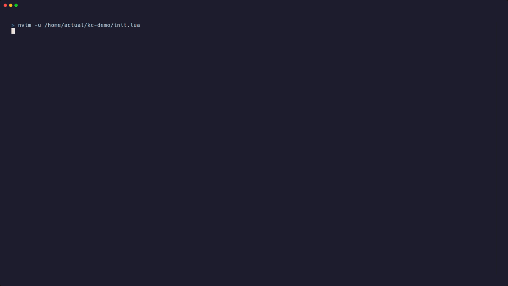

# keycoach.nvim

[](https://github.com/ActualLearner/keycoach.nvim/actions/workflows/ci.yml)
[](https://github.com/ActualLearner/keycoach.nvim/releases)
[](LICENSE)

Local-first workflow coaching for Neovim.



Type the same long commands day after day — `:Telescope find_files`, `:b#`, `:nohl` — and never
build the muscle memory for a faster way? KeyCoach quietly watches how you edit, notices what you
repeat, and suggests a keymapping that fits your setup: one you already have but keep forgetting,
or a conflict-free new one, applied with a single keystroke.

Everything runs on your machine. KeyCoach never sees inserted text, search or command arguments,
or file contents — only that you pressed keys in normal mode or ran a command. It stays quiet
while you work and shows only patterns with evidence across multiple sessions.

## What it does

- Finds frequently invoked commands and actions that already have a mapping.
- Proposes mappings for high-frequency actions that do not have one.
- Recognizes stable repeated action sequences and verbose native motions.
- Checks global, mode-specific, plugin, and loaded buffer-local mappings before
  proposing a key.
- Learns leader and prefix conventions from the effective mapping inventory.
- Lets you apply, regenerate, snooze, or exclude a recommendation.
- Tracks whether an accepted recommendation becomes part of normal work.

There are no tutorials, exercises, accounts, cloud services, or required
runtime dependencies.

## Privacy

All analysis happens locally. KeyCoach never persists inserted text, command or
search arguments, clipboard data, file contents, paths, or project names.

Exact keys are eligible for observation only in Normal, Visual, Select, and
Operator-pending modes. Content-bearing modes are reduced immediately to safe
action categories and counts. See [the product specification](docs/product-spec.md)
for the complete boundary.

## Requirements

- Neovim 0.10 or newer
- A user-selected Lua file where accepted mappings may be appended

KeyCoach uses public Neovim APIs and has no dependency on a specific
distribution or plugin manager.

## Installation

### lazy.nvim and LazyVim

```lua
{
  "ActualLearner/keycoach.nvim",
  opts = {
    mapping_file = vim.fn.stdpath("config") .. "/lua/keycoach_mappings.lua",
  },
}
```

### packer.nvim

```lua
use({
  "ActualLearner/keycoach.nvim",
  config = function()
    require("keycoach").setup({
      mapping_file = vim.fn.stdpath("config") .. "/lua/keycoach_mappings.lua",
    })
  end,
})
```

### vim-plug

```vim
Plug 'ActualLearner/keycoach.nvim'
```

```lua
require("keycoach").setup({
  mapping_file = vim.fn.stdpath("config") .. "/lua/keycoach_mappings.lua",
})
```

Make sure Neovim loads the selected mappings file. This safe pattern also works
before the first mapping has been added:

```lua
local keycoach_mappings = vim.fn.stdpath("config") .. "/lua/keycoach_mappings.lua"
if vim.uv.fs_stat(keycoach_mappings) then
  dofile(keycoach_mappings)
end
```

The first run explains the capture boundary and asks before tracking starts.
Passing `enabled = true` in `setup()` is also explicit consent.

## Usage

| Command | Purpose |
| --- | --- |
| `:KeyCoach` | Open ranked recommendations |
| `:KeyCoachEnable` | Complete setup and enable tracking |
| `:KeyCoachPause` | Pause observation immediately |
| `:KeyCoachResume` | Resume observation |
| `:KeyCoachStatus` | Show tracking and recommendation status |
| `:KeyCoachMappings` | Open the selected mappings file |
| `:KeyCoachData` | Inspect, export, or manage local data |
| `:KeyCoachClear` | Delete locally stored observations (keeps consent) |

Run `:checkhealth keycoach` to verify your setup — data directory permissions, mappings
file writability, and consent status.

The dashboard is pull-first: KeyCoach does not interrupt active editing with
recommendation popups.

### Statusline

`require("keycoach").statusline()` returns a compact status string. For
lualine.nvim:

```lua
require("lualine").setup({
  sections = {
    lualine_x = {
      { require("keycoach").statusline },
    },
  },
})
```

## Configuration

```lua
require("keycoach").setup({
  -- Required before a generated mapping can be applied.
  mapping_file = vim.fn.stdpath("config") .. "/lua/keycoach_mappings.lua",

  -- `nil` uses saved consent or starts first-run onboarding.
  enabled = nil,

  -- Detailed normalized observations expire after this many days.
  retention_days = 30,

  -- Consecutive inactivity that starts a new evidence session.
  session_idle_minutes = 30,
})
```

Accepted mappings are appended as readable `vim.keymap.set(...)` statements.
KeyCoach never rewrites or removes existing configuration.

## Data controls

Local state is stored beneath `stdpath("data")/keycoach/`. Use
`:KeyCoachClear` to remove it. Exclusions remain reversible in the dashboard.

## Development

StyLua is required for `make lint`.

```sh
make test
make check
make lint
```

Tests run headlessly in Neovim without a third-party test framework. The
recommendation engine is deterministic and exercised through portable fixture
shapes so later editor adapters can reproduce its behavior.

## Documentation

- [Product specification](docs/product-spec.md) — audience, product loop,
  capture boundary, and V1 scope
- [Recommendation engine design](docs/design/recommendation-engine.md) —
  engine interface, reliability rationale, and invariants
- [QA checklist](docs/qa-checklist.md) — the "done enough" bar for the
  v1.0.0 release
- [Architecture decision records](docs/adr/) — why observation is local-only,
  why Neovim comes first, why config writes are append-only, and why the
  engine is one atomic call
- [Roadmap](docs/roadmap.md) — deferred ideas and future platforms
- [Domain language](CONTEXT.md) — canonical terminology

## License

[MIT](LICENSE)
